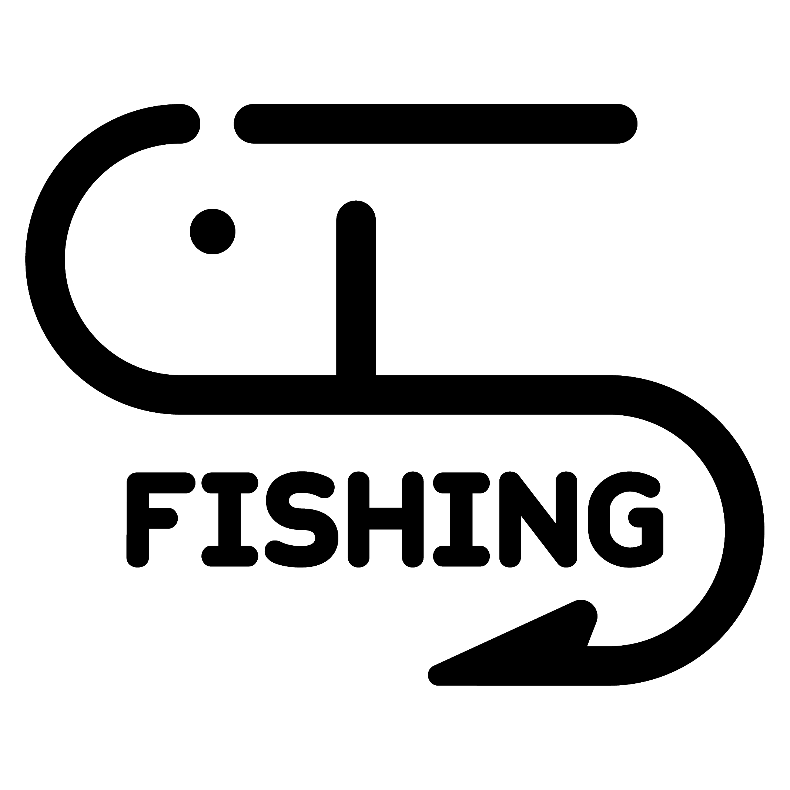
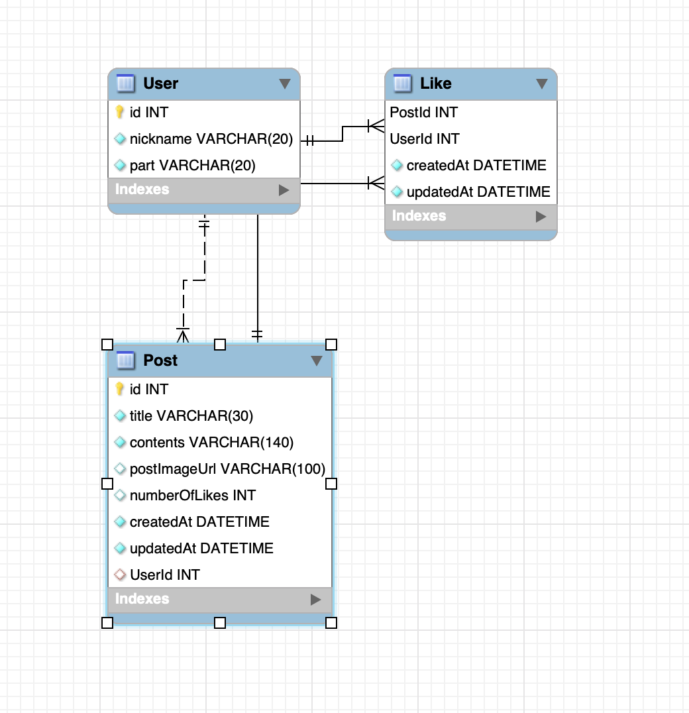

# For Ideal SOPT Hitchhiking

  

> 일 중독자 솝트인들을 위한 안내서!



## 🔧 Credit

- **Language**: JavaScript
- **Framework**: Node.js

## 💻 Getting Started

### Installation

```bash
$ git clone https://github.com/soptkerthon-kyahaha/kyahaha-server.git
$ cd [project-name]
$ npm install
```

### Develop Mode

```
$ npm start
```
## API Usage

- [createPost](https://github.com/soptkerthon-kyahaha/kyahaha-server/wiki/createPost): 사용자가 입력한 자신의 휴식 방법을 Post 테이블에 추가하고, 다른 사용자에게 보여줍니다.
- [createUser](https://github.com/soptkerthon-kyahaha/kyahaha-server/wiki/createUser): 사용자의 닉네임과 파트를 전달받아 User 테이블에 추가합니다. 
- [toggleLike](https://github.com/soptkerthon-kyahaha/kyahaha-server/wiki/toggleLike): 각 Post는 좋아요를 받을 수 있습니다.
- [readAllPosts](https://github.com/soptkerthon-kyahaha/kyahaha-server/wiki/toggleLike): 모든 Posts를 조회합니다.
- [randomImage](https://github.com/soptkerthon-kyahaha/kyahaha-server/wiki/randomImage): 랜덤으로 힐링 이미지를 가져옵니다.

## sequelize Model

```javascript
db.User = require("./userModel")(sequelize, Sequelize);
db.Post = require("./postModel")(sequelize, Sequelize);
db.Like = require("./likeModel")(sequelize, Sequelize);

/* 1 : N   User : Post */
db.User.hasMany(db.Post, { onDelete: "cascade" });
db.Post.belongsTo(db.User);

/* M : N   User : Post  => Like */
db.User.belongsToMany(db.Post, { through: "Like", as: "Liked" });
db.Post.belongsToMany(db.User, { through: "Like", as: "Liker" });
```

## ERD



## 기능 소개

- 사용자에게 랜덤 닉네임을 부여하고 해당 사용자가 속한 파트를 수집합니다.
- 해당 사용자의 닉네임과 휴식 방법을 다른 사용자들이 볼 수 있게 합니다.

------
## 👨‍👩‍👧‍👦 Developer & Role

- **김우영**([w00ing](https://github.com/w00ing)) - Post 처리 API (생성, 조회), Like 처리 API

- **윤가영**([kyY00n](https://github.com/kyY00n)) - User 생성, 랜덤 이미지 응답
